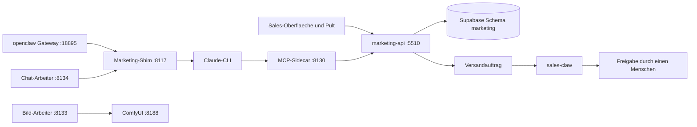

# VibeMind Marketing-Space

> **Cockpit evidence contract:** [COCKPIT_CONTRACT.md](docs/COCKPIT_CONTRACT.md)
> is authoritative for the static inventory (migrations, event-to-tool mappings,
> pytest definitions) and for what may be called `verified_live`. Zahlen stehen
> dort und in [STATUS.md](STATUS.md); dieses README beschreibt Aufbau und Betrieb.

This space lives at `vibemind-os/spaces/marketing/`. Module laufen als
`python -m spaces.marketing...` mit Arbeitsverzeichnis `vibemind-os`. Pfadlogik:
`PKG_ROOT` (Elternordner von `spaces/`, fuer Imports) und `REPO_ROOT` (naechster
Vorfahre mit einem `vibemind-os/`-Ordner) werden aus `__file__` abgeleitet
(`claw/server.py`, Zeilen 20-27). Fehlen Schluessel in der Umgebung, laedt der
MCP-Sidecar sie aus der `.env` des aeusseren Repos nach, ohne Vorhandenes zu
ueberschreiben (`_load_env_fallback`).

Weiterfuehrend: [AGENTS.md](AGENTS.md) (Regeln und Gate-Graph fuer Agenten und
Entwickler), [STATUS.md](STATUS.md) (Stand und bekannte Luecken),
[docs/](docs/) (Plaene, DSGVO-Datenfluss, Go-Live-Notizen).

## Was ist das

Ein Space fuer Marketing-Betrieb: Kampagnen, Newsletter, Vorlagen, Bilder und
Texte entstehen hier, werden in Supabase (Schema `marketing`) gehalten und von
Menschen freigegeben. **Marketing versendet nichts selbst.** Der einzige Weg
nach draussen ist sales-claw (siehe unten).

Bausteine:

- **marketing-api** (`api/server.py`, FastAPI): Entwuerfe, Vorschlaege, Vorlagen,
  Versandauftraege, Pult-Routen fuer die Sales-Oberflaeche.
- **marketing-claw** (`claw/`): MCP-Sidecar mit den Werkzeugen des Agenten,
  eigene Shim-Instanz fuer das Modell, openclaw-Gateway (`claw/gateway/`).
- **Arbeiter** (`workers/`): Vorlagen, Bilder, Chat-Agent und weitere.
- **Newsletter-Pult**: Mandanten, Inhalte, Bloecke, Gestaltung, Bilder, Chat-Agent.
- **Kurator** (`curator/`, UI unter `/curator`) und **Mockup** (`mockup/`, unter `/mockup`).

## Dienste und Ports

Das Startskript `claw/scripts/marketing-dienste-starten.ps1` startet sieben
Host-Dienste (je Dienst Portpruefung, idempotent, `-Pruefen` nur melden):

| Dienst | Port | Code |
|---|---|---|
| marketing-api | 5510 | `api/server.py` |
| marketing-claw MCP-Sidecar | 8130 | `claw/server.py` |
| eigene Marketing-Shim-Instanz (Modell-Tuer) | 8117 | `claw/shim/marketing_shim.py` (die gemeinsame Shim-Instanz ist :8114) |
| Vorlagen-Arbeiter | 8132 | `workers/vorlagen_worker.py` |
| ComfyUI (FLUX.1-schnell) | 8188 | `claw/bild_comfy.py`, Workflows in `bilder/` |
| Bild-Arbeiter | 8133 | `workers/bild_worker.py` |
| Chat-Arbeiter (Gestaltungs-Agent) | 8134 | `workers/chat_worker.py` |

Weitere Prozesse:

- `delivered_webhook` :5512 (`workers/delivered_webhook.py`), PayPal-Webhook :5514
  (`workers/paypal_webhook_handler.py`).
- openclaw-Gateway als Container `marketing-claw` auf :18895
  (`claw/gateway/docker-compose.yml`).
- Arbeiter ohne Port, vom aeusseren Launcher gestartet: `bubble_*`,
  `laura_rowboat_export`, `export_worker`, `webhook_delivery`, `mx_worker`,
  `openfang_approval_bridge`.



## Versandmodell

Betreiber-Entscheid 2026-09-12: **sales-claw ist der einzige Versandweg**
(Spec `docs/superpowers/specs/2026-09-12-sales-claw-einziger-versandweg.md`).

1. Das Werkzeug `versand_beauftragen` (`claw/werkzeuge.py`) sendet
   `POST /api/versandauftraege`.
2. Die API ruft `marketing.versandauftrag_anlegen` (Migration
   `db/043_marketing_versandauftraege.sql`).
3. sales-claw legt hoechstens einen offenen Entwurf an, den ein Mensch freigibt.

Kanaele, die das Werkzeug annimmt: `whatsapp`, `email`, `linkedin`,
`linkedin_post` (`VERSANDKANAELE`; Telegram nicht, obwohl das CHECK in 043 es
noch erlaubt). Die alten Versender `tools/_send_paranoid.py`,
`tools/_send_telegram.py` und `tools/_send_openfang.py` sind durch
`tools/versandsperre.py` gesperrt (Gate 0, nur im LIVE-Modus). Die Umgehung
`MARKETING_VERSAND_TROTZDEM=1` ist moeglich und schreibt eine Warnung ins Log.
Der Gateway-Agent hat keine Kanaele; seine Persona sagt "Du versendest NICHTS".

## Pult, Gestaltung, Bilder, Chat, Mandanten

- **Pult** (`api/pult.py`, `/api/pult/*`, Header `X-Pult-Key`): Uebersicht,
  Inhalte, Newsletter-Bloecke, Vorlagen und Layouts, Entscheidungen. Datenmodell
  in den Migrationen 050-055.
- **Gestaltung** (`api/gestaltung.py`, `claw/gestaltung.py`): rechnet eine
  Gestaltung zu einem Entwurfsbild. Die Operationen des Gestaltungs-Agenten
  (17, z. B. `block_einfuegen`, `ebene_hinzufuegen`, `bild_erzeugen`) stehen in
  `claw/agent_werkzeuge.py`. Migration 060.
- **Bilder** (`api/bilder.py`, `claw/bild_*.py`): Bildauftraege mit Arbeiter-Routen
  (Header `X-Bild-Key`), Ueberarbeiten, Freistellen, Profi-Vorlagen
  (Migrationen 056-059).
- **Chat-Agent** (`api/chat.py`, `workers/chat_worker.py`): Zwischenstand,
  Vormerken und Stopp (Migration 061).
- **Mandanten**: `vibemind` und `fin2gether` (Migrationen 050, 062).
  Markenwissen wird aus `~/.rowboat/knowledge/companys/<Firma>/` gelesen
  (`claw/markenwissen.py`, Ordner per `ROWBOAT_WISSEN_ORDNER` aenderbar),
  Notizen des Agenten liegen in `<Firma>/Agent-Notizen/`. Die Zuordnung Bild zu
  Mandant steht in `marketing.medien_mandant` (`api/medien_mandant.py`).

Authentifizierung der HTTP-Schicht: global `X-API-Key` (`MARKETING_API_KEY`),
`/api/pult/*` zusaetzlich `X-Pult-Key` (`MARKETING_PULT_KEY`), Arbeiter-Routen
`X-Bild-Key` (`MARKETING_BILD_KEY`), mutierende Vorschlags-Routen
`MARKETING_PROPOSAL_API_KEY`. Fehlt ein Schluessel, antworten die Routen mit 503
(fail-closed).

## Daten

Supabase-Schema `marketing`. 62 Migrationsdateien `db/001` bis `db/062`
(`039` fehlt, zwei Dateien tragen die Nummer `013`), dazu `verify_*.sql`:

- 001-038: Grundschema, Sync, Vorschlaege, Webhooks, Tracking, Bubble-Pipeline.
- 040 Crowdfunding; 041-043 Bruecke zu sales-claw inkl. `versandauftraege`;
  044-049 Layout- und Formularvorlagen.
- 050-052 Pult (Mandanten, Inhalte); 053-055 Newsletter-Bloecke;
  056-059 Bildauftraege, Ueberarbeiten, Profi-Vorlagen, Freistellen;
  060 Gestaltung und `chat_auftraege`; 061 Chat live; 062 `medien_mandant`.

Ob eine Migration angewendet wurde, sagen die Dateien nicht; dafuer die
`verify_*.sql` gegen die Datenbank laufen lassen.

## Starten

Vom Verzeichnis `vibemind-os` aus, mit dem gemeinsamen venv des aeusseren Repos
(`reportlab` liegt nur dort):

```powershell
# alle sieben Host-Dienste, nur fehlende werden gestartet
powershell -File spaces/marketing/claw/scripts/marketing-dienste-starten.ps1
# nur pruefen
powershell -File spaces/marketing/claw/scripts/marketing-dienste-starten.ps1 -Pruefen
# einzeln
python -m spaces.marketing.api.server
python -m spaces.marketing.claw.server
```

Das Skript legt ausserdem leere Markenwissen-Vorlagen (`Marke.md`) je Firma an,
wenn der Ordner fehlt.

## Testen

Aus `vibemind-os`:

```powershell
python -m pytest spaces/marketing -q
python -m pytest spaces/marketing/tests/test_cockpit_contract.py -q   # Drift-Waechter der Doku
```

`spaces/marketing/scripts/conftest.py` schliesst `real_case_test.py` aus (ein
Kommandozeilenwerkzeug gegen echte Postfaecher, kein Test). Messwerte (Dateien,
Definitionen) stehen in STATUS.md; ein Durchlaufergebnis ist dort nur
vermerkt, wenn es gemessen wurde.

## Zweite Instanz auf der VM

Laut Betriebsnotiz (seit 2026-09-25) laeuft marketing-api zusaetzlich auf der
Proxmox-VM aus einem Sparse-Checkout `~/marketing-os`, aktualisiert ueber
`deploy/marketing-aktualisieren.sh` in sales-claw und betrieben als systemd-Dienst
`marketing-api.service`. Sie bindet an loopback :5510 und ist im Tailnet
veroeffentlicht. Der PC-Dienst :5510 bleibt fuer die Agenten. Das Skript liegt im
Submodul sales-claw und ist aus diesem Verzeichnis nicht pruefbar.

## Beziehung zu sales-claw

sales-claw liefert die Sales-Oberflaeche, die Kontakt-Tore (Verbotsliste,
Loeschantrag, UWG-Pruefung, Kontakt-Freigabe) und stellt zu. Marketing liefert
Inhalte, Vorlagen, Bilder und Versandauftraege; die Pult-Routen
(`/api/pult/*`) und die Arbeiter-Routen sind die Schnittstelle. Marketing
liest dort nur, was die Routen herausgeben.

## Architectural decisions

| Thema | Entscheidung |
|---|---|
| Speicher | Supabase-Schema `marketing.*`, kein eigenes Postgres |
| Versand | nur ueber sales-claw (Betreiber-Entscheid 2026-09-12); eigene Versender gesperrt (`tools/versandsperre.py`) |
| Auth | globaler `X-API-Key`; `/api/pult/*` eigener `X-Pult-Key`; Arbeiter `X-Bild-Key`; fail-closed |
| Modell | Claude-CLI ueber eigene Shim-Instanz :8117 (Subscription), keine API-Schluessel im Code |
| Modelle lokal | Bilder per ComfyUI/FLUX im PC-Arbeiter; nichts davon auf der VM |
| Workflows | Python-Arbeiter; n8n-Workflows liegen als Dateien in `n8n_workflows/` (7, Nummer 06 fehlt) |
| Mandanten | `vibemind`, `fin2gether`; Markenwissen aus Rowboat |

## Weitere Ordner

`agents/` (MarketingBackendAgent mit 13 `EVENT_TO_TOOL`-Zuordnungen, `runner.py`),
`skills/newsletter-bild`, `vorlagen/newsletter`, `bilder/` (3 ComfyUI-Workflows),
`sync/` (Worker A/B/C: DB <-> Vault, IMAP), `mirofish/` (Qualitaetspruefung,
AGPL-Hinweis in `NOTICE-AGPL.md`), `tools/`, `mockup/`, `curator/`.

## Helper scripts

In `scripts/` (Verzeichnis dieses Space):

| Skript | Zweck |
|---|---|
| `vorlagen_bauen.py`, `vorlagen_einspielen.py`, `vorlagen_galerie.py` | Newsletter-Vorlagen erzeugen, einspielen, ansehen |
| `platzhalter_erzeugen.py` | Platzhalterbilder |
| `bild_probe.py`, `freistellen_probe.py`, `ueberarbeiten_probe.py` | Proben gegen den Bild-Arbeiter |
| `migration_probe.py`, `test_rls.py` | Pruefungen gegen die Datenbank |
| `snapshot_pathx_data.py`, `migrate_pathx_to_supabase.py` | Einmal-Import der alten pathx-Daten |
| `real_case_test.py` | Schleife durch echte Postfaecher; nie in einem Suitelauf |

Weitere Skripte im Space: `claw/scripts/` (Dienststart) und `n8n_workflows/`
(`import.ps1`, `register_webhooks.ps1`).
